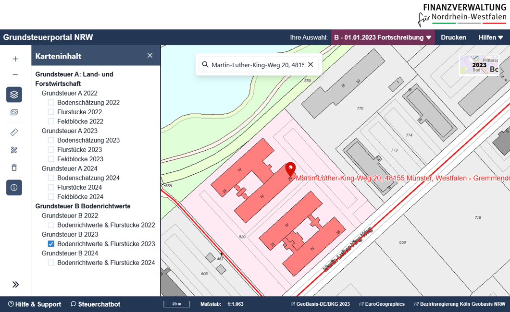

The Grundsteuerportal NRW is an information app provided by the North Rhine-Westphalia Tax Administration. It gives citizens and professionals easy access to the geospatial information relevant to property tax—directly in an intuitive map interface.

## The challenge

Property-tax assessments depend on authoritative, location-specific data. People need to identify the right parcel quickly and understand the information that applies to it—whether for **Grundsteuer B** (real property) or **Grundsteuer A** (agricultural and forestry businesses). The information must also be available for the relevant assessment date.

## The solution

Built with **Open Pioneer Trails**, the Grundsteuerportal NRW brings the required geospatial data together in one focused web application. Users can search by address or by cadastral district and parcel, select the relevant type of property tax and assessment date, and retrieve the corresponding parcel-specific information directly from the map.

For Grundsteuer B, the app provides access to standard land values (*Bodenrichtwerte*) in relation to parcels. For Grundsteuer A, it presents agricultural soil assessment information. Contextual base maps, layer controls, measurement and drawing tools, and PDF printing support clear orientation and personal documentation.

## The benefits

The portal turns complex, authoritative geodata into an accessible self-service experience. Its map-centric design makes it easier to locate a parcel, inspect the applicable data and document the current map view—while the time-based selection ensures that the information is presented in the appropriate assessment context.

As a reusable, modular foundation for geospatial web applications, Open Pioneer Trails supports a reliable and maintainable solution for a high-visibility public service.

## At a glance

| Customer | North Rhine-Westphalia Tax Administration |
| --- | --- |
| Application | Public property-tax information portal |
| Key information | Standard land values and agricultural soil assessment data |
| Core capability | Parcel-specific, assessment-date-based information retrieval |
| Technology | Open Pioneer Trails |
| Website | [grundsteuer-geodaten.nrw.de](https://grundsteuer-geodaten.nrw.de/) |
